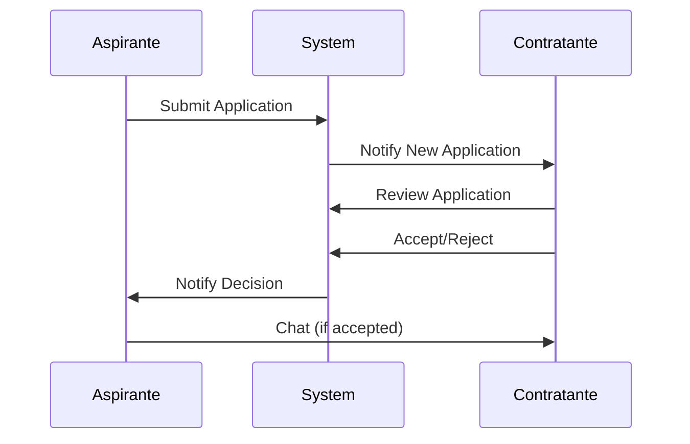

## Overview

The application system in CALMA manages the complete lifecycle of job applications, from initial submission through acceptance or rejection. The system provides distinct interfaces for job seekers (Aspirantes) and employers (Contratantes).

## Application Workflow



## For Job Seekers

Location: `src/components/ModuloAspirante/PostulacionesAspirante/PostulacionesAspirante.jsx`

### Submitting Applications

<Steps>
  <Step title="Browse Jobs">
    View available jobs in the ListaTrabajos component
  </Step>
  
  <Step title="Review Job Details">
    Click on a job to see full description and requirements
  </Step>
  
  <Step title="Apply">
    Click "Postular" button to submit your application
  </Step>
  
  <Step title="Confirmation">
    Receive instant confirmation of application submission
  </Step>
</Steps>

### Viewing My Applications

Access your applications through:

```javascript
// Route to view applications
<Route 
  path="/moduloAspirante/postulaciones/:userId" 
  element={<PostulacionesAspirante />} 
/>
```

### Application States

Applications can have the following states:

<Tabs>
  <Tab title="Pendiente">
    **Pending Review**
    
    The employer has not yet reviewed your application. This is the initial state after submission.
    
    - Yellow indicator
    - "En revisión" label
    - No action available
  </Tab>
  
  <Tab title="Aceptada">
    **Accepted**
    
    The employer has accepted your application. You can now communicate with them.
    
    - Green indicator
    - "Aceptada" label  
    - Chat button enabled
    - Access to patient records (if applicable)
  </Tab>
  
  <Tab title="Rechazada">
    **Rejected**
    
    The employer has decided not to proceed with your application.
    
    - Red indicator
    - "Rechazada" label
    - No further actions
  </Tab>
</Tabs>

### Application Card Features

Each application card displays:

```javascript
// Application card information
{
  titulo: string,              // Job title
  nombreContratante: string,   // Employer name
  estado: string,              // Application status
  fechaPostulacion: date,      // Application date
  salario: number,            // Offered salary
  ubicacion: string,          // Job location
  tipoContrato: string        // Contract type
}
```

### Actions for Accepted Applications

When an application is accepted, you can:

<CardGroup cols={2}>
  <Card title="Chat" icon="message">
    Start real-time chat with the employer
  </Card>
  <Card title="View Patient" icon="user-nurse">
    Access patient records if job involves patient care
  </Card>
  <Card title="View Details" icon="file-lines">
    Review complete job details and requirements
  </Card>
  <Card title="Schedule" icon="calendar">
    Coordinate work schedule with employer
  </Card>
</CardGroup>

## For Employers

Location: `src/components/ModuloContratante/Postulaciones/Postulaciones.jsx`

### Viewing Applications

Access applications for your job postings:

```javascript
// Route to view applications
<Route 
  path="/postulaciones/:userId" 
  element={<Postulaciones />} 
/>
```

### Application Management

<Steps>
  <Step title="Receive Applications">
    Get notifications when candidates apply to your jobs
  </Step>
  
  <Step title="Review CVs">
    Click on an application to view the candidate's full CV
  </Step>
  
  <Step title="Check Qualifications">
    Review certificates, experience, and recommendations
  </Step>
  
  <Step title="Make Decision">
    Accept or reject the application
  </Step>
  
  <Step title="Communicate">
    Chat with accepted candidates to coordinate details
  </Step>
</Steps>

### Reviewing Candidates

The employer interface shows:

```javascript
// Candidate information displayed
{
  nombreCompleto: string,      // Full name
  correo: string,              // Email
  telefono: string,            // Phone
  experiencia: string,         // Years of experience
  educacion: string,           // Education level
  certificaciones: array,      // List of certificates
  calificacion: number,        // Average rating
  cvCompleto: boolean         // CV completion status
}
```

### Accepting Applications

When accepting an application:

```javascript
// Accept application API call
const handleAccept = async (postulacionId) => {
  try {
    await axios.put(
      `${API_URL}/api/postulacion/${postulacionId}/estado`,
      { estado: 'Aceptada' }
    );
    
    // Send notification to candidate
    await axios.post(
      `${API_URL}/api/notificaciones/crear`,
      {
        destinatarioId: candidateId,
        tipo: 'POSTULACION_ACEPTADA',
        descripcion: `Tu postulación para ${jobTitle} ha sido aceptada`
      }
    );
    
    toast.success('Postulación aceptada exitosamente');
  } catch (error) {
    toast.error('Error al aceptar postulación');
  }
};
```

### Rejecting Applications

```javascript
// Reject application API call
const handleReject = async (postulacionId) => {
  try {
    await axios.put(
      `${API_URL}/api/postulacion/${postulacionId}/estado`,
      { estado: 'Rechazada' }
    );
    
    // Send notification to candidate
    await axios.post(
      `${API_URL}/api/notificaciones/crear`,
      {
        destinatarioId: candidateId,
        tipo: 'POSTULACION_RECHAZADA',
        descripcion: `Lamentamos informarte que tu postulación para ${jobTitle} no fue seleccionada`
      }
    );
    
    toast.success('Postulación rechazada');
  } catch (error) {
    toast.error('Error al rechazar postulación');
  }
};
```

## Application API

### Endpoints

<ResponseField name="POST /api/postulacion" type="object">
  Submit a new job application
  
  <Expandable title="Request Body">
    <ParamField path="idAspirante" type="number" required>
      Job seeker ID
    </ParamField>
    <ParamField path="idTrabajo" type="number" required>
      Job posting ID
    </ParamField>
    <ParamField path="estado" type="string">
      Initial state (defaults to "Pendiente")
    </ParamField>
  </Expandable>
  
  <Expandable title="Response">
    <ResponseField name="id" type="number">
      Application ID
    </ResponseField>
    <ResponseField name="fechaPostulacion" type="date">
      Submission timestamp
    </ResponseField>
    <ResponseField name="estado" type="string">
      Application state
    </ResponseField>
  </Expandable>
</ResponseField>

<ResponseField name="GET /api/postulacion/aspirante/:id" type="array">
  Get all applications for a job seeker
  
  <Expandable title="Response">
    Returns array of application objects with job details
  </Expandable>
</ResponseField>

<ResponseField name="GET /api/postulacion/trabajo/:id" type="array">
  Get all applications for a specific job posting
  
  <Expandable title="Response">
    Returns array of applications with candidate information
  </Expandable>
</ResponseField>

<ResponseField name="PUT /api/postulacion/:id/estado" type="object">
  Update application status
  
  <Expandable title="Request Body">
    <ParamField path="estado" type="string" required>
      New status: "Pendiente", "Aceptada", or "Rechazada"
    </ParamField>
  </Expandable>
</ResponseField>

<ResponseField name="GET /api/postulacion/contratista/:id/aspirantes-para-chat" type="array">
  Get all accepted candidates available for chat
  
  <Expandable title="Response">
    <ResponseField name="idUsuario" type="number">
      Candidate user ID
    </ResponseField>
    <ResponseField name="nombres" type="string">
      First name
    </ResponseField>
    <ResponseField name="apellidos" type="string">
      Last name
    </ResponseField>
    <ResponseField name="correo" type="string">
      Email address
    </ResponseField>
    <ResponseField name="trabajoTitulo" type="string">
      Related job title
    </ResponseField>
  </Expandable>
</ResponseField>

## Notifications

The application system triggers notifications:

### For Job Seekers

- New application submitted confirmation
- Application accepted notification
- Application rejected notification
- New message from employer

### For Employers

- New application received
- Candidate viewed your job posting
- Message from accepted candidate

## Filtering and Sorting

### Job Seeker Filters

```javascript
// Filter applications by status
const filterByStatus = (applications, status) => {
  if (status === 'all') return applications;
  return applications.filter(app => app.estado === status);
};

// Sort by date
const sortByDate = (applications, order = 'desc') => {
  return applications.sort((a, b) => {
    const dateA = new Date(a.fechaPostulacion);
    const dateB = new Date(b.fechaPostulacion);
    return order === 'desc' ? dateB - dateA : dateA - dateB;
  });
};
```

### Employer Filters

```javascript
// Filter by job posting
const filterByJob = (applications, jobId) => {
  return applications.filter(app => app.idTrabajo === jobId);
};

// Filter by rating
const filterByRating = (applications, minRating) => {
  return applications.filter(app => 
    app.candidato.calificacion >= minRating
  );
};
```

## Empty States

The system handles empty states gracefully:

```javascript
// No applications yet
{applications.length === 0 && (
  <div className="empty-state">
    <h3>No tienes postulaciones aún</h3>
    <p>Explora trabajos disponibles y postula a los que te interesen</p>
    <button onClick={() => navigate('/moduloAspirante/trabajos')}>
      Ver Trabajos Disponibles
    </button>
  </div>
)}
```

## Best Practices

<AccordionGroup>
  <Accordion title="For Job Seekers">
    - Apply only to jobs that match your qualifications
    - Keep your CV updated before applying
    - Respond promptly when your application is accepted
    - Be professional in all communications
    - Follow up if you haven't heard back in 2 weeks
  </Accordion>
  
  <Accordion title="For Employers">
    - Review applications within 48 hours
    - Provide feedback when rejecting candidates
    - Only accept candidates you intend to interview/hire
    - Respond to candidate messages within 24 hours
    - Be transparent about job requirements and expectations
  </Accordion>
</AccordionGroup>

## Performance Optimization

The application system uses several optimization techniques:

```javascript
// Pagination for large application lists
const [page, setPage] = useState(1);
const itemsPerPage = 10;

const paginatedApplications = applications.slice(
  (page - 1) * itemsPerPage,
  page * itemsPerPage
);

// Debounced search
const [searchTerm, setSearchTerm] = useState('');
const debouncedSearch = useDebounce(searchTerm, 500);

useEffect(() => {
  if (debouncedSearch) {
    searchApplications(debouncedSearch);
  }
}, [debouncedSearch]);
```

<Tip>
  Enable notifications to receive instant alerts when your application status changes or when you receive new applications.
</Tip>

<Note>
  Applications are automatically archived after 90 days if not acted upon.
</Note>
