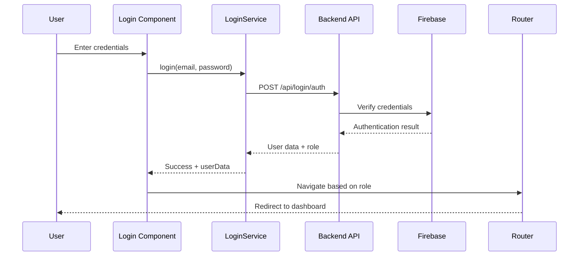

## Overview

CALMA uses a secure authentication system to protect user data and ensure that only authorized individuals can access the platform. This guide explains how authentication works, including login flows, session management, and role-based routing.

<Note>
CALMA's authentication system is built with security best practices, using Firebase integration and secure credential handling.
</Note>

---

## Authentication Architecture

### System Components

<CardGroup cols={2}>
  <Card title="Firebase Authentication" icon="fire">
    - Secure credential management
    - Password hashing and encryption
    - Token-based authentication
    - Session persistence
  </Card>
  
  <Card title="Backend API" icon="server">
    - User validation
    - Role verification
    - Data retrieval
    - Session tokens
  </Card>
  
  <Card title="LocalStorage" icon="database">
    - User data persistence
    - Cross-session state
    - Quick authentication checks
    - User preferences
  </Card>
  
  <Card title="Role-Based Routing" icon="route">
    - Aspirante (Job Seeker) routes
    - Contratante (Employer) routes
    - Protected endpoints
    - Access control
  </Card>
</CardGroup>

### Authentication Flow Diagram



---

## Login Process

### Login Component

The login process is handled by the `Login.jsx` component located at `src/components/Login/Login.jsx`.

<Steps>
  <Step title="User Input Validation">
    The system validates user input before sending credentials:
    
    ```javascript
    // From Login.jsx:32-39
    const validateEmail = (email) => {
      const regex = /^[a-zA-Z0-9._-]+@[a-zA-Z0-9.-]+\.[a-zA-Z]{2,6}$/;
      return regex.test(email);
    };
    
    const validatePassword = (password) => {
      return password.length >= 8;
    };
    ```
    
    <Info>
    - **Email**: Must be a valid email format
    - **Password**: Minimum 8 characters required
    </Info>
  </Step>
  
  <Step title="Authentication Request">
    Valid credentials are sent to the LoginService:
    
    ```javascript
    // From Login.jsx:41-62
    const handleLogin = async (e) => {
      e.preventDefault();
      setLoading(true);
      
      if (!validateEmail(username)) {
        toast.error('Por favor ingresa un correo electrónico válido');
        return;
      }
      
      if (!validatePassword(password)) {
        toast.error('La contraseña debe tener al menos 8 caracteres');
        return;
      }
      
      try {
        const data = await login(username, password);
        localStorage.setItem('userData', JSON.stringify(data));
        toast.success('¡Acceso exitoso! Bienvenido.');
        setRedirecting(true);
      } catch (err) {
        // Error handling
      }
    };
    ```
  </Step>
  
  <Step title="Backend Authentication">
    The LoginService communicates with the backend API:
    
    ```javascript
    // From LoginService.js:6-22
    export const login = async (username, password) => {
      const params = new URLSearchParams();
      params.append('correo', username);
      params.append('contrasena', password);
      
      const response = await axios.post(
        `${API_URL}/auth`,
        params.toString(),
        {
          headers: {
            'Content-Type': 'application/x-www-form-urlencoded',
          },
        }
      );
      
      if (response.data.success) {
        return response.data; // Returns all user data including role
      }
    };
    ```
    
    <Warning>
    Credentials are sent via POST with URL-encoded format for security.
    </Warning>
  </Step>
</Steps>

### API Endpoint

The backend authentication endpoint:

<CodeGroup>
```bash Endpoint
POST http://backend-alb-283290471.us-east-2.elb.amazonaws.com:8090/api/login/auth
```

```plaintext Request Format
Content-Type: application/x-www-form-urlencoded

correo=user@example.com&contrasena=password123
```

```json Response Format
{
  "success": true,
  "usuarioId": 123,
  "rol": "aspirante",
  "aspiranteId": 45,
  "contratanteId": null,
  "nombres": "Juan",
  "apellidos": "Pérez",
  "correo": "user@example.com"
}
```
</CodeGroup>

### Error Handling

The system provides specific error messages for different failure scenarios:

```javascript
// From Login.jsx:85-98
catch (err) {
  if (err.message === 'Correo no encontrado') {
    toast.error('El correo no está registrado');
  } else if (err.message === 'Contraseña incorrecta') {
    toast.error('La contraseña es incorrecta');
  } else if (err.message.includes('401')) {
    toast.error('Usuario o contraseña incorrectos');
  } else {
    toast.error(err.response?.data?.message || 'Error desconocido');
  }
}
```

<CardGroup cols={2}>
  <Card title="401 Unauthorized" icon="times-circle">
    Invalid credentials - email or password is incorrect
  </Card>
  
  <Card title="404 Not Found" icon="question-circle">
    Email not registered in the system
  </Card>
  
  <Card title="500 Server Error" icon="exclamation-triangle">
    Backend service unavailable or internal error
  </Card>
  
  <Card title="Network Error" icon="wifi">
    Connection issues - check internet connectivity
  </Card>
</CardGroup>

---

## Role-Based Routing

### User Roles

CALMA supports two primary user roles:

<Tabs>
  <Tab title="Aspirante (Job Seeker)">
    **Role Identifier**: `"aspirante"`
    
    **Primary ID**: `aspiranteId`
    
    **Dashboard Route**: `/moduloAspirante`
    
    **Capabilities**:
    - Create and manage CV
    - Browse job listings
    - Apply for positions
    - Chat with employers
    - Receive notifications
    - View application status
  </Tab>
  
  <Tab title="Contratante (Employer)">
    **Role Identifier**: `"contratante"`
    
    **Primary ID**: `contratanteId`
    
    **Dashboard Route**: `/moduloContratante`
    
    **Capabilities**:
    - Post job opportunities
    - Review applications
    - Chat with candidates
    - Manage patient records
    - Rate completed work
    - Access analytics
  </Tab>
</Tabs>

### Routing Logic

After successful authentication, users are routed based on their role:

```javascript
// From Login.jsx:63-84
const checkConnectionAndNavigate = async () => {
  if (navigator.onLine) {
    if (data.rol === 'aspirante') {
      await handleAspiranteLogin(data);
    } else if (data.rol === 'contratante') {
      navigate('/moduloContratante', {
        state: { userId: data.contratanteId },
        replace: true
      });
    }
  } else {
    toast.error('Estás sin conexión. Esperando reconexión...');
    window.addEventListener('online', () => {
      checkConnectionAndNavigate();
    }, { once: true });
  }
};
```

<Info>
The system includes offline detection and waits for network connectivity before routing.
</Info>

### Aspirante-Specific Routing

For job seekers, the system checks CV status before routing:

```javascript
// From Login.jsx:101-148
const handleAspiranteLogin = async (userData) => {
  try {
    // Check if CV exists
    const cvData = await getCVByAspiranteId(userData.aspiranteId);
    
    if (!cvData) {
      // No CV - redirect to creation
      navigate('/cv/new', {
        state: {
          userId: userData.aspiranteId,
          isFirstTime: true,
          fromLogin: true
        },
        replace: true
      });
      return;
    }
    
    // Validate CV ownership
    if (cvData.aspirante?.idAspirante?.toString() !== userData.aspiranteId?.toString()) {
      throw new Error("El CV no pertenece al usuario actual");
    }
    
    // CV exists - go to dashboard
    navigate('/moduloAspirante', {
      state: {
        userId: userData.aspiranteId,
        hasCV: true,
        cvData: cvData,
        cvId: cvData.id_cv
      },
      replace: true
    });
  } catch (error) {
    // Error fallback - redirect to CV creation
    navigate('/cv/new', {
      state: {
        userId: userData.aspiranteId,
        error: error.message
      },
      replace: true
    });
  }
};
```

<Steps>
  <Step title="CV Check">
    System queries the CV service for the user's CV data.
  </Step>
  
  <Step title="First-Time User">
    If no CV exists, redirect to `/cv/new` with `isFirstTime: true` flag.
  </Step>
  
  <Step title="Returning User">
    If CV exists, redirect to `/moduloAspirante` with CV data in state.
  </Step>
  
  <Step title="Error Handling">
    Any errors default to CV creation page for user safety.
  </Step>
</Steps>

---

## Session Management

### LocalStorage Usage

User authentication state is persisted using browser localStorage:

```javascript
// From Login.jsx:60
localStorage.setItem('userData', JSON.stringify(data));
```

#### Stored User Data Structure

```json
{
  "success": true,
  "usuarioId": 123,
  "rol": "aspirante" | "contratante",
  "aspiranteId": 45,        // for job seekers
  "contratanteId": null,    // for employers
  "nombres": "FirstName",
  "apellidos": "LastName",
  "correo": "email@example.com"
}
```

<Warning>
**Security Note**: Never store sensitive data like passwords in localStorage. Only store non-sensitive user identification and role information.
</Warning>

### Retrieving User Data

Components throughout the application retrieve user data from localStorage:

<CodeGroup>
```javascript Aspirante Component
// From moduloAspirante.jsx:20-28
useEffect(() => {
  const userData = JSON.parse(localStorage.getItem('userData') || '{}');
  const aspiranteId = location.state?.aspiranteId || userData?.aspiranteId;
  
  if (!aspiranteId) {
    console.warn('No se encontró idAspirante');
    return;
  }
  
  setIdAspirante(aspiranteId);
}, [location.state]);
```

```javascript Contratante Component
// From moduloContratante.jsx:101-119
useEffect(() => {
  let contratistaId = null;
  
  if (location.state?.userId) {
    contratistaId = location.state.userId;
  } else {
    const userData = JSON.parse(localStorage.getItem('userData'));
    if (userData?.contratanteId) {
      contratistaId = userData.contratanteId;
    }
  }
  
  setUserId(contratistaId);
}, [location.state]);
```
</CodeGroup>

<Info>
**Priority Order**:
1. Router state (passed during navigation)
2. localStorage fallback (for page refreshes)
3. Redirect to login if neither available
</Info>

### Session Persistence

Sessions persist across:
- **Page refreshes** - Data retrieved from localStorage
- **Browser restarts** - localStorage survives browser closure
- **Tab changes** - Shared across tabs in same domain

<Card title="Session Timeout" icon="clock">
  CALMA does not currently implement automatic session timeout. Sessions remain valid until:
  - User explicitly logs out
  - localStorage is manually cleared
  - Browser cache is cleared
  
  <Warning>
  For security on shared computers, always log out explicitly.
  </Warning>
</Card>

---

## Firebase Integration

### Firebase Configuration

While the source code references Firebase authentication, the actual Firebase configuration would typically be in a dedicated config file.

<Accordion title="Typical Firebase Setup">
  ```javascript
  // firebase-config.js (example structure)
  import { initializeApp } from 'firebase/app';
  import { getAuth } from 'firebase/auth';
  
  const firebaseConfig = {
    apiKey: process.env.REACT_APP_FIREBASE_API_KEY,
    authDomain: process.env.REACT_APP_FIREBASE_AUTH_DOMAIN,
    projectId: process.env.REACT_APP_FIREBASE_PROJECT_ID,
    storageBucket: process.env.REACT_APP_FIREBASE_STORAGE_BUCKET,
    messagingSenderId: process.env.REACT_APP_FIREBASE_MESSAGING_SENDER_ID,
    appId: process.env.REACT_APP_FIREBASE_APP_ID
  };
  
  const app = initializeApp(firebaseConfig);
  export const auth = getAuth(app);
  ```
</Accordion>

### Firebase Features

<CardGroup cols={2}>
  <Card title="Authentication" icon="user-shield">
    - Email/password authentication
    - Password hashing (bcrypt)
    - Secure token generation
    - OAuth support (if enabled)
  </Card>
  
  <Card title="Security" icon="lock">
    - Encrypted credential storage
    - XSS protection
    - CSRF prevention
    - Rate limiting
  </Card>
</CardGroup>

---

## Password Recovery

CALMA includes a password recovery system:

### Recovery Flow

<Steps>
  <Step title="Request Recovery">
    User clicks "¿Olvidaste tu contraseña?" on login page:
    
    ```javascript
    // From Login.jsx:248-256
    <button
      type="button"
      className={styles.forgotPasswordLink}
      onClick={() => setShowRecoveryModal(true)}
    >
      ¿Olvidaste tu contraseña?
    </button>
    ```
  </Step>
  
  <Step title="Enter Email">
    Modal appears requesting the registered email address:
    
    ```javascript
    // From Login.jsx:150-185
    const handleRecovery = async () => {
      if (!validateEmail(recoveryEmail)) {
        toast.error('Por favor ingresa un correo electrónico válido');
        return;
      }
      
      // Verify email is registered
      const resUsuario = await fetch(
        `http://backend-alb-283290471.us-east-2.elb.amazonaws.com:8090/api/usuarios/por-correo?correo=${recoveryEmail}`
      );
      
      if (!resUsuario.ok) {
        throw new Error('Correo no registrado');
      }
      
      const { userId, userType } = await resUsuario.json();
    };
    ```
  </Step>
  
  <Step title="Generate Reset Token">
    System generates a secure reset token:
    
    ```javascript
    // From Login.jsx:164-176
    const resToken = await fetch(
      `http://backend-alb-283290471.us-east-2.elb.amazonaws.com:8090/api/password/request-reset`,
      {
        method: 'POST',
        headers: { 'Content-Type': 'application/x-www-form-urlencoded' },
        body: new URLSearchParams({ userId, userType }),
      }
    );
    ```
  </Step>
  
  <Step title="Email Sent">
    Recovery link is emailed to the user's registered address.
    
    ```javascript
    toast.success(`Se ha enviado un enlace de recuperación a ${recoveryEmail}`);
    ```
  </Step>
</Steps>

<Warning>
Reset tokens should be:
- **Time-limited** (typically 1-24 hours)
- **Single-use** (invalidated after password reset)
- **Cryptographically secure** (randomly generated)
</Warning>

---

## Security Best Practices

### Implemented Security Measures

<AccordionGroup>
  <Accordion title="Input Validation">
    - Email format validation using regex
    - Password minimum length requirement (8 characters)
    - Sanitization of user inputs
    - Prevention of SQL injection via parameterized queries
  </Accordion>
  
  <Accordion title="Secure Communication">
    - All authentication requests use POST method
    - Credentials sent via URL-encoded format
    - HTTPS should be enforced in production
    - No credentials in URL parameters
  </Accordion>
  
  <Accordion title="Error Handling">
    - Generic error messages prevent user enumeration
    - Specific errors only in development mode
    - Logging of authentication attempts (backend)
    - Rate limiting on failed attempts (should be implemented)
  </Accordion>
  
  <Accordion title="Session Security">
    - No password storage in localStorage
    - Role verification on each protected route
    - Token-based authentication
    - Automatic logout on token expiration (recommended)
  </Accordion>
</AccordionGroup>

### Recommended Enhancements

<Card title="Additional Security Measures" icon="shield-alt">
  Consider implementing:
  
  1. **Multi-Factor Authentication (MFA)**
     - SMS or email verification codes
     - Authenticator app support
  
  2. **Session Timeout**
     - Automatic logout after inactivity
     - Warning before timeout
  
  3. **Password Strength Requirements**
     - Minimum complexity rules
     - Common password prevention
     - Password history checking
  
  4. **Account Lockout**
     - Temporary lock after failed attempts
     - CAPTCHA after multiple failures
  
  5. **Security Monitoring**
     - Login attempt logging
     - Suspicious activity detection
     - Admin notification system
</Card>

---

## API Authentication Endpoints

### Available Endpoints

<CodeGroup>
```bash Login
POST /api/login/auth
Content-Type: application/x-www-form-urlencoded

Body:
correo=user@example.com
contrasena=password123
```

```bash User Lookup
GET /api/usuarios/por-correo?correo=user@example.com

Response:
{
  "userId": 123,
  "userType": "aspirante"
}
```

```bash Password Reset Request
POST /api/password/request-reset
Content-Type: application/x-www-form-urlencoded

Body:
userId=123
userType=aspirante
```

```bash Get User by ID
GET /api/usuarios/{id}

Response:
{
  "id": 123,
  "nombres": "Juan",
  "apellidos": "Pérez",
  "correo": "user@example.com",
  "cedula": "1234567890",
  "telefono": "0987654321"
}
```
</CodeGroup>

---

## Troubleshooting Authentication Issues

<AccordionGroup>
  <Accordion title="Login Fails with Valid Credentials">
    **Possible Causes**:
    - Backend service is down
    - Network connectivity issues
    - Incorrect API endpoint URL
    - CORS configuration problems
    
    **Solutions**:
    - Check browser console for error messages
    - Verify backend service is running
    - Test API endpoint with curl or Postman
    - Check CORS headers in backend configuration
  </Accordion>
  
  <Accordion title="User Redirected to Wrong Dashboard">
    **Possible Causes**:
    - Incorrect role in database
    - localStorage corruption
    - Stale session data
    
    **Solutions**:
    - Clear localStorage and log in again
    - Verify user role in database
    - Check authentication response data
  </Accordion>
  
  <Accordion title="Session Lost After Refresh">
    **Possible Causes**:
    - localStorage disabled in browser
    - Incognito/private browsing mode
    - Browser extension interference
    
    **Solutions**:
    - Enable localStorage in browser settings
    - Use regular browsing mode
    - Disable conflicting extensions
    - Check browser console for storage errors
  </Accordion>
  
  <Accordion title="Password Recovery Not Working">
    **Possible Causes**:
    - Email not registered in system
    - Email service configuration issues
    - Spam filter blocking emails
    
    **Solutions**:
    - Verify email address is correct
    - Check spam/junk folder
    - Contact support for manual verification
    - Try alternative recovery methods
  </Accordion>
</AccordionGroup>

---

## Development Tips

### Testing Authentication Locally

<CodeGroup>
```javascript Mock Login Data
// For testing purposes
const mockUserData = {
  success: true,
  usuarioId: 1,
  rol: 'aspirante',
  aspiranteId: 1,
  contratanteId: null,
  nombres: 'Test',
  apellidos: 'User',
  correo: 'test@example.com'
};

localStorage.setItem('userData', JSON.stringify(mockUserData));
```

```bash Test API with curl
# Test login endpoint
curl -X POST \
  http://backend-alb-283290471.us-east-2.elb.amazonaws.com:8090/api/login/auth \
  -H 'Content-Type: application/x-www-form-urlencoded' \
  -d 'correo=test@example.com&contrasena=password123'
```
</CodeGroup>

### Debugging Authentication

<Accordion title="Console Logging">
  Add strategic console logs to track authentication flow:
  
  ```javascript
  console.log('1. Starting authentication...');
  console.log('2. Credentials validated');
  console.log('3. API response:', response.data);
  console.log('4. User role:', response.data.rol);
  console.log('5. Routing to:', routePath);
  ```
</Accordion>

<Accordion title="Network Monitoring">
  Use browser DevTools:
  - **Network tab**: Monitor API requests and responses
  - **Application tab**: Inspect localStorage contents
  - **Console tab**: View error messages and warnings
</Accordion>

---

## Summary

<Check>
**Key Takeaways**:

1. CALMA uses **Firebase** for secure authentication
2. **Two user roles**: Aspirante (job seeker) and Contratante (employer)
3. **localStorage** persists session data across page loads
4. **Role-based routing** directs users to appropriate dashboards
5. **CV validation** for aspirantes before accessing job listings
6. **Password recovery** via email with secure token generation
7. **Error handling** provides user-friendly feedback
8. **Security best practices** including input validation and secure communication
</Check>

<Card title="Support" icon="life-ring">
  For authentication issues or questions:
  
  **Email**: calmasoporte2025@gmail.com
  
  **Response Time**: 24-48 hours
</Card>